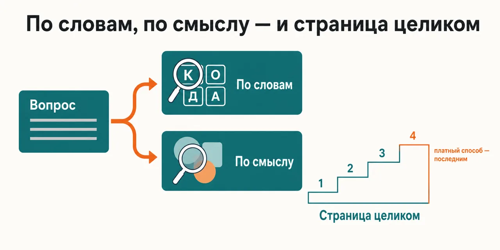
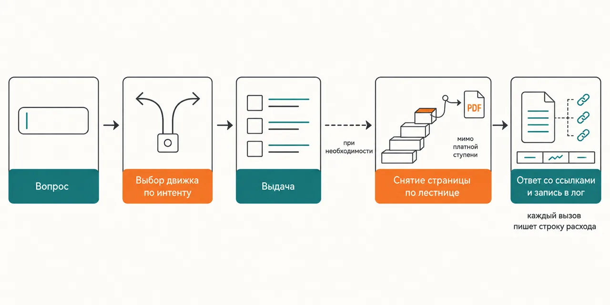

English · [Русский](README.md)

# You search by words, the thing you need is filed by meaning — and the page still arrives as a retelling of its headline

The query goes to the engine that handles that kind of question — Brave for words, Exa for meaning —
and the page text is pulled by a separate ladder with Firecrawl on the last rung.

```
claude plugin marketplace add https://github.com/beCyborg/jadlis-hub
claude plugin install jadlis-search@jadlis
```

The Brave and Firecrawl keys are required and you are asked for them during install; put `jadlis-search` in
first — `research` and `science-research` pull it in as a dependency, but an auto-installed
dependency never asks for keys.



In words: on the left, your question in plain language; on the right, two branches — search by words
and search by meaning — plus a separate ladder that pulls a full page, with the paid route as its
last rung.

This is my workbench published as it is, not a product: whatever I stopped using, I removed.

## Before → after

| By hand | With an AI chat | With this plugin |
|---|---|---|
| **Which way you search.** One way at a time: either the exact words, or a description of what you need. | It searches with whatever is built into it, and you cannot pick the engine. | Brave answers words and operators, Exa answers a description of the page; the engine follows the kind of question. |
| **What arrives instead of the page.** You open tabs one by one and read them yourself. | A retelling of the headline and the first paragraphs — you cannot see where the page ended and the guessing began. | The text is pulled by a ladder: free routes first, Firecrawl last, PDFs sent to local extraction. |
| **Where the keys live.** In config files in plain text, and in your shell history along the way. | It never asks for keys — and never reaches paid sources. | You enter them once, the value goes into the macOS Keychain; to change one, run `/plugin configure jadlis-search@jadlis`. |
| **What happens when a channel goes quiet.** You cannot tell whether it broke or was meant to be that way. | It answers as if nothing had dropped out. | Without an optional key the channel degrades along a documented route: Reddit falls back to the no-auth ladder, YouTube to site search and local transcripts. |
| **What the run cost.** The invoice arrives at the end of the month, too late to unpick. | Spending is never shown at all. | Every call writes a line into the cost log; there is a daily soft cap and a `report` summary. |

## How it works



Going in — your question in plain language.
Inside — intent decides who answers: Brave for words, Exa for meaning; if the full page text is
needed it is pulled by a ladder, and a hook keeps PDFs and x.com away from Firecrawl.
Coming out — an answer with links, and a spending line in the log.

In words: question → engine picked by intent → results → the full page pulled by the ladder if
needed → an answer with links and a line in the cost log.

Starting up, the plugin brings five MCP servers: Brave, Firecrawl, two Reddit ones and YouTube. Keys
are set up and checked by a separate skill, `/jadlis-search:keys` — it shows what you already have (names
and lengths, never values), takes the missing ones one at a time, and runs a smoke check across every
source with a PASS/FAIL table.

## Installing and the first run

**a) Text to paste to an agent.** Copy the whole thing into a Claude Code chat:

```
You are the installer. Install the plugin jadlis-search from the jadlis marketplace on this Mac.
First tell me whether this is macOS: key storage relies on the macOS Keychain.
Then run exactly these commands, verbatim, shortening nothing:
1. claude plugin marketplace add https://github.com/beCyborg/jadlis-hub
2. claude plugin install jadlis-search@jadlis
3. claude plugin list — show me the line about jadlis-search and its version.
The plugin will ask for two required keys, Brave and Firecrawl: I type the values myself, you
never print them and never copy them anywhere — check only "present" or "absent".
Before each command show it to me in full and wait for "yes". If I say "no", do not run it,
tell me what you skipped, and move on.
If a command returns an error, stop, show me the output, and do not move to the next one.
```

**b) Commands by hand.**

```
claude plugin marketplace add https://github.com/beCyborg/jadlis-hub
claude plugin install jadlis-search@jadlis
claude plugin list
```

The first command installs nothing — it adds the marketplace. Only the second one installs, and one
line removes it: `claude plugin uninstall jadlis-search@jadlis --keep-data`.

You can pass the keys straight into the install — `claude plugin install jadlis-search@jadlis --config
BRAVE_API_KEY=… --config FIRECRAWL_API_KEY=…` — but then the value stays in your shell history.
The main route is the `/plugin configure jadlis-search@jadlis` dialog right in the chat: key fields are
masked as you type and the values go into the macOS Keychain. That same dialog is how you change a
key later — passing `--config` again to an already installed plugin silently does nothing (checked
2026-09-07).

**c) The short command.** Open Claude Code in the folder you work in and type:

```
/search <your question>
```

If it is not found, check the name with `claude plugin list`. Keys and source checks live in
`/jadlis-search:keys`; after you enter keys for the first time, restart Claude Code — MCP servers come up
when the session starts.

## Limits, cost, updating

**What it does not do.** It does not write a report and does not keep a claim ledger — that is
`research` and `science-research`; here you get the search, page and key layer only. It does not
cross-verify claims: what was found is what was found. It does not reach closed or logged-in places.
It stores keys nowhere but the macOS Keychain: on any other system only environment variables remain.
And it does not cancel the providers' invoices — you pay them, directly.

**What you need.** Two required paid keys: Brave (the Search plan) and Firecrawl. Two optional ones,
RedditAPIs and YouTube Data API: without them those servers show red in `/mcp`, and that is expected —
Reddit falls back to the no-auth ladder, YouTube to site search and local transcripts. The Exa
semantic layer is switched on by its own key, and `/jadlis-search:keys` sets that one up, not the install
dialog. The optional `FIRECRAWL_API_URL` field in the install dialog is the Firecrawl API address;
the default is the official one, change it only for your own proxy or key rotator. External binaries: `jq`, `uv`, `pdftotext` from poppler, optionally `yt-dlp`. macOS only. I do
not restate other people's pricing: the invoices are theirs, check with them.

No minimum versions are pinned: the plugin checks that the binaries are there — `jq`, `uv`,
`pdftotext` from poppler (`brew install poppler`), optionally `yt-dlp`; verified with the current
Homebrew versions on macOS.

**How tokens get spent.** A run is light: one question, one engine call; the heavy fan-outs live in
`research` and `science-research`. Pulling full pages costs more than the rest, which is why the
ladder puts Firecrawl last and sends PDFs to local extraction. Every call writes a line into the cost
log, there is a daily soft cap, and a wide fan-out is agreed with you first.

**Verified where I work:** my Mac, my subscriptions, my keys. Verified on macOS only; Linux should
work with the same binaries in PATH, Windows is untested.

**Terms of use.** There is no license: all rights reserved by the author. You may read it and use it
personally. Commercial use, republishing and bundling it into your own products — by arrangement
with me.

**Updating.** With a third-party marketplace, auto-update is off on your side: until you run the
first command you keep the version you installed.

```
claude plugin marketplace update jadlis
claude plugin update jadlis-search@jadlis
claude plugin list
```

Reinstall, if something ended up crooked:

```
claude plugin uninstall jadlis-search@jadlis --keep-data && claude plugin install jadlis-search@jadlis
```
